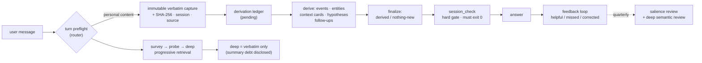

<div align="center">

# Personal Understanding

### Give your AI agent a memory that actually knows you — and can prove where every fact came from.

**Verbatim-first · Evidence-chain · Anti-fabrication · Local-first · One folder, zero dependencies**

[](https://pypi.org/project/personal-understanding/)
[](https://pypi.org/project/personal-understanding/)
[](LICENSE)
[](https://github.com/caix84476-netizen/personal-understanding/stargazers)

[中文文档](README.zh-CN.md) · [架构](#architecture) · [快速开始](#quick-start) · [设计原则](#design-principles)

> **Two skill languages:** the repo ships **`SKILL.md`** (English) and **`SKILL.zh-CN.md`** (中文) — two brains, one shared bilingual engine. Install either by renaming it to `SKILL.md` in your skills folder. 中文用户可直接用 `SKILL.zh-CN.md`，配合中文档案效果最佳。

`agent-memory` `mcp` `claude` `codex` `skills` `local-first` `personal-knowledge`

</div>

---

## The problem with every memory system you've tried

Typical agent memory has a dirty secret: **the model summarizes first and stores the summary.** Your words get paraphrased, compressed, and blended with the model's own interpretations on day one. Six months later, "you" are a stack of lossy summaries — and when the model gets you wrong, you can't even audit why, because the original evidence is gone.

Worse, failures are silent: a corrupted write reports success, an invented date looks plausible, the model's guess about *why you are the way you are* quietly hardens into "fact".

**Personal Understanding flips the pipeline:**

> ### Save the exact words first. Derive everything else from them. Prove every path.

Every personal message is captured **verbatim and immutably** (SHA-256 hashed, timestamped, session-tagged) *before* anything else happens. Structured understanding — timeline, entities, context cards, causal hypotheses — is then built **on top of** the evidence, with every derived fact linking back to the quote it came from. When the agent misremembers you, you audit it. When it doesn't know, it says so.

## What makes it different

| | Typical memory tools | Personal Understanding |
|---|---|---|
| What gets stored first | the model's summary | **your exact words — immutable, hashed** |
| Derived facts traceable to source | rarely | ✓ every record links back to its verbatim |
| Model guesses marked as guesses | no | ✓ hypothesis layer, `candidate` by default, never silently promoted |
| Old lossy summaries | silently reused | ✓ flagged as **summary debt** — retrieval discloses "this part comes from an old summary" |
| Says "saved" when the save failed | happens | ✗ impossible — capture is read back; a hard gate (`session_check`) must exit 0 before "archive updated" may be claimed |
| Invented dates, merged people, fake causal edges | possible | ✗ forbidden by written policy and enforced by validators |
| Runtime | server + vector DB + embeddings | **one folder, Python stdlib only** |
| Where your data lives | often their cloud | **your machine. Full stop.** |

## Same message, two very different memories

**Without Personal Understanding** — a typical memory implementation:

> **You:** I finally played my first full song on guitar today. Three weeks until I perform it at my cousin's wedding — honestly less nervous than before.
> **AI:** That's awesome, congrats! 🎸 Keep it up!
>
> *What got stored: `"user played guitar, feeling positive."` A lossy summary. No source, no date, no people, no way to check it. Next month it's gone — or worse, silently paraphrased into something you never said.*

**With Personal Understanding** — the same message:

> **You:** I finally played my first full song on guitar today. Three weeks until I perform it at my cousin's wedding — honestly less nervous than before.
> **AI:** *(first: captures your complete message verbatim — SHA-256-hashed, timestamped, session-tagged — before anything else)*
> *(then: derives and links — `event` "first full song on guitar" · salience `supporting` · linked to `Sara` and the wedding goal · updates your current state: performance anxiety ↓)*
> **AI:** First full song is a real milestone. Last time, performing at the wedding made you nervous — how does it feel now that it's three weeks out?
>
> *Every claim traces back to your exact words. Ask "where does that come from?" and the agent shows you the original quote — not a paraphrase of a paraphrase. And when it's the wedding week, the archive checks in by itself.*

## Highlights

- 🗣️ **Verbatim-first capture** — the complete message, word for word, before any summarizing, splitting, or interpreting. Corrections add new captures; nothing is ever silently overwritten.
- 🔁 **Derivation closure** — a successful capture is not a finished update. Every capture must be split into records, linked, and closed — or explicitly closed as "nothing new" with a stated reason. Orphans can't slip through.
- 🧠 **Human-like three-layer recall** — `survey` (a compact routing map) → `probe` (fan out along entities, context cards, and time neighbors) → `deep` (verify the exact quote). No vector dumps, no keyword-only search.
- 📻 **Cold recall ladder** — for "I forget, we talked about something like this…" moments: probe from any hint, walk time neighbors, then browse a time window like flipping through an old photo album.
- 🕸️ **Entities + context cards** — people, schools, places, objects, works, games, concepts, environments — plus cross-entity cards ("school × football") so shared stories are reachable from any side. Vague pronouns are kept as `unresolved_referent`, never fabricated into fake people.
- 🔬 **Causal hypothesis layer** — "why am I like this?" gets a structured answer: claim, mechanism, supports, counterexamples, competing explanations, scope, confidence — always `candidate`, never presented as fact.
- ⏰ **Proactive follow-ups** — "let's see in a few days" becomes a tracked loop. When it's due, the agent checks back *with the original context*, not a context-free nag.
- 🧭 **Guided starters** — you don't have to know what to say. The skill reads its own gaps (empty domains, open loops, stale current state) and offers one warm, concrete question at a time (`python scripts/conversation_starters.py`).
- 🚦 **Hard gates, not vibes** — three-state validation (`clean` / `warnings` / `failed`), atomic writes everywhere, `session_check` as a non-zero-exit gate before any "the archive is updated" claim.
- 📉 **Summary debt accounting** — legacy material that lost its source is labeled, counted, and disclosed in retrieval. It can never impersonate verbatim.
- 📊 **Audit dashboard** — a local, read-only panel: real counts, validation state, and the full chain from any event back to the original words. The point is that *you* can check the skill follows its own rules.
- 🔌 **Drop-in for your client** — an idempotent installer auto-detects and registers a local MCP server across Claude clients, Codex, VS Code / Cursor / Windsurf / Cline / Trae, ZCode, and generic `.agents` configs.
- 💾 **Backups with integrity** — SHA-256-manifested snapshots, mirror-to-second-location support (any rclone remote), and a quarterly salience review that gracefully demotes stale imported weights instead of letting them fossilize.

## Architecture



On disk it's plain files you can read, grep, and back up: `sources/conversation/` (immutable verbatim + hashes) and `memory/v2/` (fragments, timeline, entities, contexts, follow-ups, hypotheses, decision traces) — with legacy records kept as a compatibility layer and honestly marked `summary_only`.

## Quick start

```bash
# 1. clone into your client's skills directory
git clone https://github.com/caix84476-netizen/personal-understanding.git \
    ~/.claude/skills/personal-understanding      # or ~/.codex/skills/ , or your client's equivalent

# 2. bootstrap the archive skeleton (directories + generic domain branches; idempotent)
python scripts/init_archive.py

# 3. register the local MCP server (auto-detects clients; idempotent)
python scripts/install_mcp.py --auto            # Windows: just double-click register-mcp.cmd

# 4. restart your client session — the personal_* tools go live

# 5. open the audit dashboard any time
python scripts/open_dashboard.py                # Windows: double-click open-dashboard.cmd
```

**Requirements:** Python 3.10+ · stdlib only, zero pip installs · Windows / macOS / Linux.

**Prefer pip?** The MCP server + installer are also on [PyPI](https://pypi.org/project/personal-understanding/): `pip install personal-understanding`, then `personal-understanding-install` to register the local MCP server. The pip package ships the Python side only — for the full skill brain (`SKILL.md` + dashboard), use the clone steps above.

Then just talk normally: *"I've been feeling…"*, *"remember that…"*, *"why do I keep…"* — the skill's description triggers on personal content, captures your words, and takes over from there. Ask *"what do you remember about…"*, or *"where does that come from?"* and follow the evidence chain.

## Your data stays yours

- Everything is processed **locally**, in the skill folder. No telemetry, no cloud calls, no embeddings shipped to third parties.
- The shipped `.gitignore` blocks `memory/`, `sources/`, and `backups/` — so you can version-control your skill folder and **never commit your private archive by accident**.
- Sensitivity labels (`private` / `highly-private`) control *relevance*, not secrecy-from-you: unrelated questions never leak unrelated private material.

## Design principles

These are written policy, enforced by validators — not aspirations:

1. **Verbatim fidelity first** — no summary ever poses as the user's words; `summary_only` is marked as such forever.
2. **No fabricated certainty** — uncertain dates stay uncertain; vague pronouns don't become people; single events never become causes.
3. **Newer words outrank older archives** — corrections build `supersedes` / `contradicts` chains; nothing is silently erased.
4. **One salience axis** — `pivotal / key / supporting / passing` on a single 0–3 scale; imported weights admit they're heuristics.
5. **Silence is not feedback** — only explicit corrections and confirmations, with quotable evidence, feed the feedback loop.
6. **Structure clean ≠ semantically correct** — deep review exists precisely because validators can't catch meaning.

## Where it came from

Not a framework thought up in one afternoon — a working archive refined through daily use and a dozen hardening rounds (see the [CHANGELOG](CHANGELOG.md)): a salience-decay bug that once shredded frontmatter is why all writes are now atomic and reviewed; survey used to load ~818 KB of legacy catalog per turn — it's a ~90 KB routing map now (~230 ms); the whole derivation-closure and hard-gate machinery exists because "trust me, I saved it" wasn't good enough for real life.

## Status

- **Current release: v2.2.0** — schema stable (`memory/v2/` v2.0.0), actively maintained. Also on [PyPI](https://pypi.org/project/personal-understanding/).
- Works with any MCP-capable client; the skill itself works in **any language** (English by default — it mirrors yours).
- Roadmap: editable dashboard pages, richer cold-recall ranking, optional encrypted archive-at-rest.

## Contributing

Issues and PRs welcome — especially: new client installers for `install_mcp.py`, dashboard improvements, and i18n of the low-signal detector.

## License

[MIT](LICENSE) © 2026 caix84476-netizen

---

<div align="center">

If Personal Understanding saves you from re-explaining yourself to your AI for the nth time, **a star ⭐ helps others find it.**

</div>
