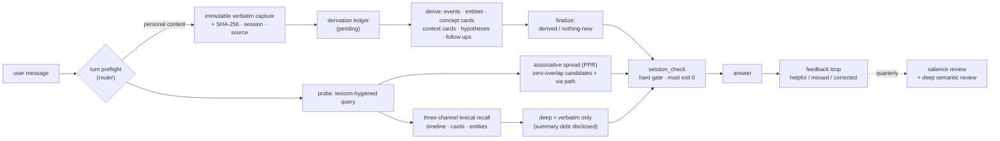

<div align="center">

# Personal Understanding

### A memory that recalls the way you do — by evidence chains and association, not similarity scores.

**Verbatim-first · Evidence-chain · Associative recall · Anti-fabrication · Local-first · One folder, zero dependencies**

[](https://pypi.org/project/personal-understanding/)
[](https://pypi.org/project/personal-understanding/)
[](LICENSE)
[](https://github.com/caix84476-netizen/personal-understanding/stargazers)

[中文文档](README.zh-CN.md) · [How recall works](#under-the-hood-how-recall-actually-works) · [Quick start](#quick-start) · [Design principles](#design-principles)

`agent-memory` `mcp` `claude` `codex` `skills` `local-first` `associative-recall` `personal-knowledge`

</div>

---

## The problem with every memory system you've tried

Typical agent memory has a dirty secret: **the model summarizes first and stores the summary.** Your words get paraphrased, compressed, and blended with the model's own interpretations on day one. Six months later, "you" are a stack of lossy summaries — and when the model gets you wrong, you can't even audit why, because the original evidence is gone.

And the retrieval underneath is *similarity*. Here's the part most memory products don't say out loud:

> **Recall is not similarity.** When you complain "this game feels like trash, the hits have no weight," a human who knows you thinks: *he once said his benchmark for game feel was Red Dead Redemption 2, and The Witcher 3 lost to it.* Zero words overlap between the complaint and that memory — a similarity score gives it **zero**, and the memory you need most is invisible. Human recall is directional and associative: you think of a thing's opposite, its reason, the same mental core one abstraction up. That is not what a vector database computes.

**Personal Understanding fixes both halves:**

> ### Save the exact words first. Recall by evidence chains and graph spread, not similarity. Prove every path.

Every personal message is captured **verbatim and immutably** (SHA-256 hashed, timestamped, session-tagged) *before* anything else happens. Structured understanding is built **on top of** the evidence, every derived fact linking back to the quote it came from. And recall runs through a measured three-layer stack that can surface records with *zero lexical overlap* — with the association path shown, so the model can judge it instead of trusting a bare score. When the agent misremembers you, you audit it. When it doesn't know, it says so.

## What makes it different

| | Typical memory tools | Personal Understanding |
|---|---|---|
| What gets stored first | the model's summary | **your exact words — immutable, hashed** |
| Recall model | similarity over summaries | **three-channel lexical + associative graph spread, evidence path visible** |
| Derived facts traceable to source | rarely | ✓ every record links back to its verbatim |
| Model guesses marked as guesses | no | ✓ hypothesis layer, `candidate` by default, never silently promoted |
| Old lossy summaries | silently reused | ✓ flagged as **summary debt** — retrieval discloses "this part comes from an old summary" |
| Says "saved" when the save failed | happens | ✗ impossible — a hard gate (`session_check`) must exit 0 before "archive updated" may be claimed |
| Invented dates, merged people, fake causal edges | possible | ✗ forbidden by written policy and enforced by validators |
| Runtime | server + vector DB + embeddings | **one folder, Python stdlib only** |
| Where your data lives | often their cloud | **your machine. Full stop.** |

## Why not just use your agent's built-in memory?

Newer agents ship with "memory" now — if that's enough for you, use it. This project exists for the people who hit its walls:

| | Built-in agent memory | Personal Understanding |
|---|---|---|
| Data ownership | locked in the vendor's account, rarely exportable, gone when you switch tools | a plain-text folder on your machine — read it, grep it, back it up, move it |
| Portability | memory only works inside that product | one archive, any MCP client — Claude, Codex, ZCode, VS Code, whatever comes next |
| Auditability | black box — you can't see what got stored, or why it answered that way | every derived fact links back to the exact quote; the retrieval trace shows *why* each record surfaced, and what was deliberately held back |
| Retrieval | fuzzy summary recall | three-channel + associative recall that bottoms out in your original words |
| Privacy | your personal history on their servers | local only — no telemetry, no cloud calls |

Vendor memory optimizes for a smoother conversation inside their product. This project optimizes for a memory **you own, that moves with you across tools, and that can prove where every fact came from.** Different products — vendor memory getting better doesn't make this one redundant.

## Under the hood: how recall actually works

Most memory READMEs stop at "we use embeddings." Here is the whole stack, because the mechanics *are* the product.

**Layer 0 — self-trained lexicon (query hygiene).** Every query is tokenized against a vendored dictionary (jieba, MIT) **plus a lexicon the archive trains on itself**: any 2–4 char string occurring in ≥2 archive texts becomes a word, so proper nouns no general dictionary knows (`弦一郎`, `艾迪芬奇`, `晕3D`) are recognized automatically. Out-of-vocabulary slices keep their recall but are weight-capped so cross-word accidents (`郎我`) can no longer out-anchor real terms. Measured root cause this fixed: the query `巫师3` splits into `巫师` + `3`, and a stray `3` matches dates inside record IDs — it once handed a *driver's-license record* the top slot for a Witcher query.

**Layer 1 — three-channel lexical recall.** Timeline events, fact/model cards, and entity cards are scored separately (IDF-weighted, length-normalized, anchor-demoted) instead of one blended soup — a complaint about game feel reaches the *fact* card even when no *event* matches. Every probe records a decision trace: what was selected, what was held back and why.

**Layer 2 — associative spread (the recall humans do).** Entities and **concept cards** (game-feel, money-and-guilt, body-limits, reading-taste …) form a graph. A personalized PageRank spread — local, hub-capped so popular nodes can't dress popularity up as association — surfaces records the query shares **zero words with**, each with its `via` path visible:

- *"this game's hits feel like paper"* → `concept: gameplay-feel` → **the Witcher-3-vs-RDR2 feel-anchoring record** (no shared word — exactly the recall a friend would do)
- *"book drought, recommend something"* → `concept: reading-taste` → your reading history and taste anchor
- *"recommend me a game"* → `concept: narrative-games` → **the hard rule that 3D-sickness is a body-level exclusion** — the *opposite* side of the desire, one edge away

**The stack is scored on a 16-round simulated-usage matrix** (real user-tone queries across 8 life domains, model-graded); every release re-runs it. Zero expected-recall regressions through 2.6.0, while the two "all-channels-missed" cases above went from nothing to surfaced.

**Why not embeddings?** They're the right tool at archive scale, and the design leaves a slot for them. But at personal-archive scale the measured failures are lexical and structural, not semantic — and a similarity score is unauditable by nature: it returns a number, never a path. Here, when a memory surfaces, *why* it surfaced is always shown.

## Same message, two very different memories

**Without Personal Understanding** — a typical memory implementation:

> **You:** I finally played my first full song on guitar today. Three weeks until I perform it at my cousin's wedding — honestly less nervous than before.
> **AI:** That's awesome, congrats! 🎸 Keep it up!
>
> *What got stored: `"user played guitar, feeling positive."` A lossy summary. No source, no date, no people, no way to check it. Next month it's gone — or worse, silently paraphrased into something you never said.*

**With Personal Understanding** — the same message:

> **You:** I finally played my first full song on guitar today. Three weeks until I perform it at my cousin's wedding — honestly less nervous than before.
> **AI:** *(first: captures your complete message verbatim — SHA-256-hashed, timestamped, session-tagged — before anything else)*
> *(then: derives and links — `event` "first full song on guitar" · salience `supporting` · linked to `Sara` and the wedding goal · updates your current state: performance anxiety ↓)*
> **AI:** First full song is a real milestone. Last time, performing at the wedding made you nervous — how does it feel now that it's three weeks out?
>
> *Every claim traces back to your exact words. Ask "where does that come from?" and the agent shows you the original quote — not a paraphrase of a paraphrase. And when it's the wedding week, the archive checks in by itself.*

## Highlights

- 🗣️ **Verbatim-first capture** — the complete message, word for word, before any summarizing, splitting, or interpreting. Corrections add new captures; nothing is ever silently overwritten.
- 🔁 **Derivation closure** — a successful capture is not a finished update. Every capture must be split into records, linked, and closed — or explicitly closed as "nothing new" with a stated reason. Orphans can't slip through.
- 🧠 **Human-like progressive recall** — `survey` (compact routing map) → `probe` (fan out along entities, concept cards, and time neighbors) → `deep` (verify the exact quote). No vector dumps, no keyword-only search.
- 🕸️ **Associative recall with visible paths** — zero-overlap memories surface through a concept-card graph with the association path attached; the model judges the link, nothing arrives as an unexplained score.
- 📻 **Cold recall ladder** — for "I forget, we talked about something like this…" moments: probe from any hint, walk time neighbors, then browse a time window like flipping through an old photo album.
- 🔬 **Causal hypothesis layer** — "why am I like this?" gets a structured answer: claim, mechanism, supports, counterexamples, competing explanations, scope, confidence — always `candidate`, never presented as fact.
- ⏰ **Proactive follow-ups** — "let's see in a few days" becomes a tracked loop. When it's due, the agent checks back *with the original context*, not a context-free nag.
- 🚦 **Hard gates, not vibes** — three-state validation (`clean` / `warnings` / `failed`), atomic writes everywhere, `session_check` as a non-zero-exit gate before any "the archive is updated" claim. Reads that cannot corrupt the archive have an audited degraded path; writes never do.
- 📉 **Summary debt accounting** — legacy material that lost its source is labeled, counted, and disclosed in retrieval. It can never impersonate verbatim.
- 📊 **Pipeline timeline & audit dashboard** — replay one turn's whole life (gating decision → capture → closure → every retrieval query, association, and held-back candidate) as a single read-only page, or browse the full dashboard.
- 🔌 **Drop-in for your client** — an idempotent installer auto-detects and registers a local MCP server across Claude clients, Codex, VS Code / Cursor / Windsurf / Cline / Trae, ZCode, and generic `.agents` configs.
- 💾 **Backups with integrity** — SHA-256-manifested snapshots, mirror-to-second-location support (any rclone remote), and a quarterly salience review that gracefully demotes stale imported weights instead of letting them fossilize.

## Architecture



On disk it's plain files you can read, grep, and back up: `sources/conversation/` (immutable verbatim + hashes) and `memory/v2/` (fragments, timeline, entities, concept cards, contexts, follow-ups, hypotheses, decision traces) — with legacy records kept as a compatibility layer and honestly marked `summary_only`.

## Quick start

```bash
# 1. clone into your client's skills directory
git clone https://github.com/caix84476-netizen/personal-understanding.git \
    ~/.claude/skills/personal-understanding      # or ~/.codex/skills/ , or your client's equivalent

# 2. bootstrap the archive skeleton (directories + generic domain branches; idempotent)
python scripts/init_archive.py

# 3. register the local MCP server (auto-detects clients; idempotent)
python scripts/install_mcp.py --auto            # Windows: just double-click register-mcp.cmd

# 4. restart your client session — the personal_* tools go live

# 5. open the audit dashboard / replay any turn's pipeline any time
python scripts/open_dashboard.py                # Windows: double-click open-dashboard.cmd
python scripts/pipeline_view.py --latest 5
```

**Requirements:** Python 3.10+ · stdlib only, zero pip installs · Windows / macOS / Linux.

**Prefer pip?** The MCP server + installer are also on [PyPI](https://pypi.org/project/personal-understanding/): `pip install personal-understanding`, then `personal-understanding-install` to register the local MCP server. The pip package ships the Python side only — for the full skill brain (`SKILL.md` + dashboard), use the clone steps above. **As of 2.2.1 the wheel is no longer a stale snapshot** — every packaged file is byte-identical to the source tree, re-verified on every release. One caveat remains: `personal-understanding-install` registers the server but does not bootstrap an archive root, so start from scratch with `python -m personal_understanding.init_archive`. The clone steps above remain the recommended path for the full skill.

Then just talk normally: *"I've been feeling…"*, *"remember that…"*, *"why do I keep…"* — the skill's description triggers on personal content, captures your words, and takes over from there. Ask *"what do you remember about…"*, or *"where does that come from?"* and follow the evidence chain.

## Your data stays yours

- Everything is processed **locally**, in the skill folder. No telemetry, no cloud calls, no embeddings shipped to third parties.
- The shipped `.gitignore` blocks `memory/`, `sources/`, and `backups/` — so you can version-control your skill folder and **never commit your private archive by accident**.
- Sensitivity labels (`private` / `highly-private`) control *relevance*, not secrecy-from-you: unrelated questions never leak unrelated private material.

## Design principles

These are written policy, enforced by validators — not aspirations:

1. **Verbatim fidelity first** — no summary ever poses as the user's words; `summary_only` is marked as such forever.
2. **Recall must be auditable** — similarity alone never decides; associative candidates carry their graph path, and every probe logs what was selected *and* what was deliberately held back.
3. **No fabricated certainty** — uncertain dates stay uncertain; vague pronouns don't become people; single events never become causes; association edges are declared semantics, never invented for a prettier graph.
4. **Newer words outrank older archives** — corrections build `supersedes` / `contradicts` chains; nothing is silently erased.
5. **One salience axis** — `pivotal / key / supporting / passing` on a single 0–3 scale; imported weights admit they're heuristics.
6. **Silence is not feedback** — only explicit corrections and confirmations, with quotable evidence, feed the feedback loop.
7. **Structure clean ≠ semantically correct** — deep review exists precisely because validators can't catch meaning.

## Where it came from

Not a framework thought up in one afternoon — a working archive refined through daily use and a dozen hardening rounds (see the [CHANGELOG](CHANGELOG.md)): a salience-decay bug that once shredded frontmatter is why all writes are now atomic and reviewed; survey used to load ~818 KB of legacy catalog per turn — it's a ~90 KB routing map now (~230 ms); the associative layer exists because its author kept hitting the wall that "recall is not similarity" — the 2.6.0 changelog documents the measured root causes, the designs tried and rejected, and the regression that proved deletion was wrong before demotion was chosen.

## Status

- **Current release: v2.6.0** — associative retrieval (self-trained lexicon + concept-card graph + PPR spread), footprint-round read gate, pipeline timeline; two-tier invocation with footprint discipline; schema stable (`memory/v2/` v2.0.0); actively maintained. Also on [PyPI](https://pypi.org/project/personal-understanding/).
- Works with any MCP-capable client. The skill brain (`SKILL.md`) is written in Chinese and works with archives in any language; retrieval is tuned for mixed Chinese/Latin text and degrades gracefully elsewhere.
- Roadmap: editable dashboard pages, richer cold-recall ranking, optional vector side-channel for very large archives (pluggable by design), optional encrypted archive-at-rest.

## Contributing

Issues and PRs welcome — especially: new client installers for `install_mcp.py`, dashboard improvements, and evaluation matrices for languages beyond Chinese.

## License

[MIT](LICENSE) © 2026 caix84476-netizen

---

<div align="center">

If Personal Understanding saves you from re-explaining yourself to your AI for the nth time, **a star ⭐ helps others find it.**

</div>
