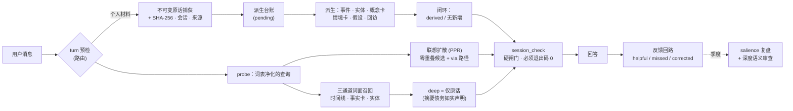

<div align="center">

# Personal Understanding

### 一个像你一样回忆的记忆系统——靠证据链和联想，而不是相似度分数。

**原话优先 · 证据链 · 联想检索 · 防造假 · 本地优先 · 一个文件夹零依赖**

[](https://pypi.org/project/personal-understanding/)
[](https://pypi.org/project/personal-understanding/)
[](LICENSE)
[](https://github.com/caix84476-netizen/personal-understanding/stargazers)

[English](README.md) · [召回机制详解](#召回到底怎么工作的) · [快速开始](#快速开始) · [设计原则](#设计原则)

`agent-memory` `mcp` `claude` `codex` `skills` `local-first` `associative-recall` `personal-knowledge`

</div>

---

## 你试过的每个记忆系统都有同一个毛病

典型的 agent 记忆有个上不了台面的秘密：**模型先总结，再把总结存起来。**你的话在第一天就被转述、压缩、混入模型自己的理解。半年后，"你"就是一堆有损摘要的堆叠——当模型记错你的时候，你连审计都做不了，因为原始证据早没了。

而底下的检索是*相似度*。这是大多数记忆产品不会明说的部分：

> **回忆不是相似度。**当你抱怨"这游戏烂得跟纸糊的一样，打击感没有重量"，一个真正了解你的人会想：*他以前说过他的手感标杆是荒野大镖客2，巫师3输给了它。*抱怨和那条记忆之间**零词面重叠**——相似度分数给它 **0 分**，你最需要的那条记忆不可见。人的回忆有方向性、有联想：你会想到一件事的反面、它的原因、往上抽一层的精神内核。这不是向量数据库算的东西。

**Personal Understanding 把两半都修了：**

> ### 先存原话。靠证据链和图扩散回忆，不靠相似度。每条路径可证明。

每条个人消息在任何其他动作发生之前，被**逐字、不可变地**捕获（SHA-256 哈希、时间戳、会话标记）。结构化理解**建立在**证据之上，每条派生事实都回链到它出自的原话。检索跑在一套经过实测的三层栈上，能召回*零词面重叠*的记录——联想路径随身携带，模型可以审视这条联想，而不是盲信一个分数。模型记错你，你审计它；它不知道，就直说不知道。

## 它有什么不一样

| | 典型记忆工具 | Personal Understanding |
|---|---|---|
| 先存什么 | 模型的总结 | **你的原话——不可变、有哈希** |
| 检索模型 | 摘要上的相似度 | **三通道词面 + 联想图扩散，证据路径可见** |
| 派生事实可回溯来源 | 很少 | ✓ 每条记录回链原话 |
| 模型猜测标记为猜测 | 否 | ✓ 假设层默认 `candidate`，绝不静默转正 |
| 有损旧摘要 | 静默复用 | ✓ 标记为**摘要债务**——检索时如实声明"这段来自旧摘要" |
| 存失败却说存好了 | 时有发生 | ✗ 不可能——硬闸门 `session_check` 必须退出码 0 才允许声称"档案已更新" |
| 编造日期、合并人物、虚构因果边 | 可能 | ✗ 成文政策禁止，校验器强制执行 |
| 运行时 | 服务端 + 向量库 + embedding | **一个文件夹，纯 Python 标准库** |
| 数据在哪 | 常在他们的云上 | **你的机器。句号。** |

## 为什么不直接用 agent 自带记忆？

新版 agent 都自带"记忆"了——如果够用，用那个。这个项目为撞到它墙的人而存在：

| | 自带记忆 | Personal Understanding |
|---|---|---|
| 数据所有权 | 锁在厂商账号里，难导出，换工具即失 | 你机器上的纯文本文件夹——可读、可 grep、可备份、可迁移 |
| 可迁移性 | 只在那家产品里有效 | 一份档案，任意 MCP 客户端——Claude、Codex、ZCode、VS Code，及未来一切 |
| 可审计性 | 黑盒——存了什么、为什么这么答，看不见 | 每条派生事实回链原话；检索 trace 展示每条记录*为什么*浮出、什么被有意扣下 |
| 检索 | 模糊摘要回忆 | 三通道 + 联想检索，最终落到你的原话 |
| 隐私 | 个人历史在他们的服务器上 | 纯本地——无遥测、无云端调用 |

厂商记忆优化的是他们产品里的对话体验。本项目优化的是一个**你拥有的、跨工具迁移的、能证明每条事实出处**的记忆。是不同的产品——厂商记忆做得再好也不替代这个。

## 召回到底怎么工作的

大多数记忆 README 写到"我们用了 embedding"就停了。这里是整套栈，因为**机制本身就是产品**。

**第 0 层——自训练词表（查询净化）。**每条查询先过一本 vendored 词典（jieba，MIT）**加一本档案自己训练出来的词表**：档案文本里出现 ≥2 次的 2-4 字串自动成为词，任何通用词典都不认识的专名（`弦一郎`、`艾迪芬奇`、`晕3D`）被自动识别。词典外切片保留召回能力但权重封顶，跨词假切片（`郎我`）再也无法冒充锚定词。实测修掉的根因：查询 `巫师3` 会被切成 `巫师` + `3`，而游离的 `3` 能命中记录 ID 里的日期——它曾让一条*驾照记录*在巫师3查询里霸占第 1 名。

**第 1 层——三通道词面召回。**时间事件、事实/模型卡、实体卡分开打分（IDF 加权、长度归一、锚定降权），不是一锅炖——关于手感的抱怨能直达*事实卡*，即使没有任何*事件*匹配。每次 probe 都记录决策 trace：选了什么、扣下了什么、为什么。

**第 2 层——联想扩散（人脑那种回忆）。**实体与**概念卡**（操作手感、金钱自主、身体限制、品味锚点……）构成一张图。个性化 PageRank 扩散——局部扩散、枢纽封顶，热门节点没法把"热度"伪装成"联想"——把与查询**零词面重叠**的记录带到眼前，每条带可见的 `via` 路径：

- *"这游戏打击感跟纸糊的一样"* → `概念：操作手感` → **巫师3-荒野大镖客2手感锚定记录**（零共享词——朋友才会做的联想）
- *"书荒了，推荐点东西"* → `概念：品味锚点` → 你的阅读史与品味锚点
- *"推荐个游戏"* → `概念：叙事体验` → **晕3D 属于身体级硬排除的规则**——欲望的反面，一步可达

**这套栈跑在一张 16 轮模拟使用矩阵上**（按真实用户语气的查询、横跨 8 个生活领域、由模型评分）；每次发布都复跑。截至 2.6.0 预期召回零回归，而上面两个"全通道扑空"的案例从查不到变成了能召回。

**为什么不用 embedding？**在档案规模变大后它们是对的工具，架构上也留了插槽。但个人档案量级下实测的失败是词面与结构性的，不是语义性的——而且相似度分数天然不可审计：它返回一个数字，从不返回路径。在这里，一条记忆浮出时，*为什么*浮出永远可见。

## 同一句话，两种完全不同的记忆

**没有 Personal Understanding**——典型记忆实现：

> **你：** 今天终于完整弹下来一首曲子了。三周后要在表哥婚礼上演奏，说实话没以前那么紧张了。
> **AI：** 太棒了恭喜！🎸 继续加油！
>
> *存下来的东西：`"用户弹吉他，情绪积极。"` 一条有损摘要。没有来源、没有日期、没有人物、无法核验。下个月它就没了——或者更糟，被悄悄转述成你没说过的话。*

**有 Personal Understanding**——同一句话：

> **你：** 今天终于完整弹下来一首曲子了。三周后要在表哥婚礼上演奏，说实话没以前那么紧张了。
> **AI：** *（第一步：把这条消息逐字捕获——SHA-256 哈希、时间戳、会话标记——先于一切动作）*
> *（然后：派生并链接——`event`"第一次完整弹完一首曲子"·salience `关键`·链接到 `Sara` 与婚礼目标·更新当前状态：演奏焦虑 ↓）*
> **AI：** 完整弹下第一首是真正的里程碑。上次在婚礼上演奏你是紧张的，现在离婚礼还有三周，感觉怎么样？
>
> *每句话都能回溯到你的原话。问"这从哪来的？"，模型给你看原始引文——不是转述的转述。而且到了婚礼周，档案会自己来查一回。*

## 核心特性

- 🗣️ **原话优先捕获**——完整消息逐字保存，先于一切总结、拆分和解读。纠正是新增捕获，永远不静默覆盖。
- 🔁 **派生闭环**——捕获成功不等于更新完成。每条捕获必须拆分成记录、建立链接、闭环——或以明确理由关闭为"无新增"。孤立捕获无处遁形。
- 🧠 **人类式渐进召回**——`survey`（紧凑路由地图）→ `probe`（沿实体、概念卡、时间邻居发散）→ `deep`（核验原话）。没有向量倾倒，也不是纯关键词。
- 🕸️ **路径可见的联想召回**——零重叠记忆经概念卡图浮出，联想路径随身携带；模型审视链接，没有来路不明的分数。
- 📻 **冷回溯阶梯**——"我忘了，好像聊过类似的……"：从任意线索 probe、沿时间邻居走、再像翻老相册一样按时间窗浏览。
- 🔬 **因果假设层**——"我为什么会这样"有结构化答案：主张、机制、支持、反例、竞争解释、范围、置信度——永远 `candidate`，绝不当事实。
- ⏰ **主动回访**——"过几天看结果"变成被追踪的回路。到期时带着**原始上下文**来问，不是没头没尾的催。
- 🚦 **硬闸门，不靠自觉**——三态校验（`clean` / `warnings` / `failed`）、处处原子写、`session_check` 作为"档案已更新"声明前的非零退出闸门。不损坏档案的读取有留痕的降级通道；写入永远没有。
- 📉 **摘要债务台账**——丢失来源的旧材料被标记、计数、在检索中如实声明。它永远不能冒充原话。
- 📊 **管线时间线与审计面板**——把一轮对话的一生（判档理由 → 捕获 → 闭环 → 每次检索查询、联想与被扣下的候选）回放成一页只读视图，或浏览完整面板。
- 🔌 **接入你的客户端**——幂等安装器自动检测并注册本地 MCP 服务：Claude 系、Codex、VS Code / Cursor / Windsurf / Cline / Trae、ZCode 及通用 `.agents` 配置。
- 💾 **带完整性校验的备份**——SHA-256 清单快照、镜像到第二位置（任意 rclone remote）、季度 salience 复盘优雅降权过时的导入权重而非任其石化。

## 架构



磁盘上是你可以直接读、直接 grep、直接备份的纯文件：`sources/conversation/`（不可变原话 + 哈希）和 `memory/v2/`（片段、时间线、实体、概念卡、情境卡、回访、假设、决策 trace）——legacy 记录保留为兼容层并诚实标记 `summary_only`。

## 快速开始

```bash
# 1. 克隆到客户端 skills 目录
git clone https://github.com/caix84476-netizen/personal-understanding.git \
    ~/.claude/skills/personal-understanding      # 或 ~/.codex/skills/ ，或你客户端的对应路径

# 2. 初始化档案骨架（目录 + 通用领域分支；幂等）
python scripts/init_archive.py

# 3. 注册本地 MCP 服务（自动检测客户端；幂等）
python scripts/install_mcp.py --auto            # Windows：双击 register-mcp.cmd

# 4. 重启客户端会话——personal_* 工具上线

# 5. 随时打开审计面板 / 回放任意一轮的管线
python scripts/open_dashboard.py                # Windows：双击 open-dashboard.cmd
python scripts/pipeline_view.py --latest 5
```

**要求：**Python 3.10+ · 纯标准库，零 pip 安装 · Windows / macOS / Linux。

**想用 pip？**MCP 服务 + 安装器也发布在 [PyPI](https://pypi.org/project/personal-understanding/)：`pip install personal-understanding`，然后 `personal-understanding-install` 注册本地 MCP 服务。pip 包只含 Python 侧——完整的技能大脑（`SKILL.md` + 面板）请走上面的克隆路径。**自 2.2.1 起 wheel 不再是过时快照**——每个打包文件与源码树逐字节一致，每次发布复验。仍有一个注意点：`personal-understanding-install` 只注册服务，不初始化档案根目录，从零开始请用 `python -m personal_understanding.init_archive`。完整技能仍推荐上面的克隆路径。

然后正常说话就行："我最近感觉……"、"记住……"、"我为什么总是……"——skill 的描述词在个人内容上自动触发，捕获你的话并接管后续。问"你还记得……吗"，或"这从哪来的？"，顺着证据链走。

## 数据归你

- 一切处理都在**本地**、在 skill 文件夹内。无遥测、无云端调用、不向第三方发送 embedding。
- 随附的 `.gitignore` 屏蔽 `memory/`、`sources/`、`backups/`——你可以放心把 skill 目录纳入版本控制，**绝不误提交私人档案**。
- 敏感度标签（`private` / `highly-private`）控制的是*相关性*，不是对你保密：无关问题不主动泄露无关私密材料。

## 设计原则

以下是成文政策、由校验器强制执行——不是愿景：

1. **原话保真第一**——任何摘要不得冒充用户的话；`summary_only` 永远如实标记。
2. **召回必须可审计**——相似度绝不单独决定；联想候选携带图路径，每次 probe 记录选中了什么、也记录*有意扣下了*什么。
3. **不编造确定性**——不确定的日期保持不确定；模糊代词不变成人物；单次事件不成因果；联想边是声明出来的语义，绝不为图好看而造。
4. **新话优先于旧档**——纠正走 `supersedes` / `contradicts` 链；任何东西不被静默擦除。
5. **唯一 salience 轴**——`主轴 / 关键 / 关联 / 提及`，单一 0–3 刻度；导入权重承认是启发式。
6. **沉默不是反馈**——只有带可引用证据的明确纠正与确认才进反馈回路。
7. **结构干净 ≠ 语义正确**——深度审查的存在，正因为校验器抓不住语义。

## 它从哪来

不是一个下午想出来的框架——一份在日常使用中打磨、经历了十几轮加固的工作档案（见 [CHANGELOG](CHANGELOG.md)）：一次曾把 frontmatter 撕碎的 salience 衰减 bug，是一切写入如今原子化且经过复查的原因；survey 曾每轮加载约 818 KB 的 legacy 目录——现在是一张约 90 KB 的路由地图（约 230 ms）；联想层之所以存在，是因为作者反复撞上"回忆不是相似度"这堵墙——2.6.0 的 changelog 记录了实测根因、试过又被放弃的方案，以及那次证明"删除"错误、"降权"正确的回归。

## 状态

- **当前版本：v2.6.0**——联想检索（自训练词表 + 概念卡图 + PPR 扩散）、足迹轮读取闸门、管线时间线；两档调用带足迹纪律；schema 稳定（`memory/v2/` v2.0.0）；持续维护。同步发布于 [PyPI](https://pypi.org/project/personal-understanding/)。
- 兼容任何支持 MCP 的客户端。技能大脑（`SKILL.md`）以中文写成，档案可用任何语言；检索针对中英混排调优，其他语言优雅降级。
- 路线图：可编辑面板页、更丰富的冷回溯排序、面向超大档案的可选向量旁路（按可插拔设计）、可选的静态加密档案。

## 参与贡献

欢迎 Issue 和 PR——尤其是：`install_mcp.py` 的新客户端安装器、面板改进、以及中文之外语言的评估矩阵。

## 许可

[MIT](LICENSE) © 2026 caix84476-netizen

---

<div align="center">

如果 Personal Understanding 让你少向你的 AI 解释第 N 次你自己，**一个 star ⭐ 能帮更多人找到它。**

</div>
