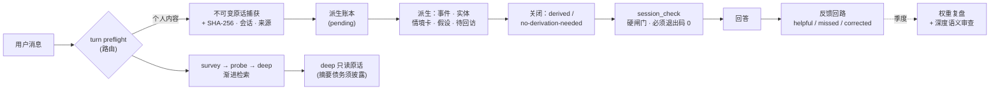

<div align="center">

# Personal Understanding（个人理解）

### 给你的 AI 助手一份"真的认识你"的记忆——而且每条结论都能拿出证据。

**原话优先 · 证据链 · 反编造 · 本地优先 · 一个文件夹，零依赖**

[](https://pypi.org/project/personal-understanding/)
[](https://pypi.org/project/personal-understanding/)
[](LICENSE)
[](https://github.com/caix84476-netizen/personal-understanding/stargazers)

[English](README.md) · [架构](#架构) · [快速开始](#快速开始) · [设计原则](#设计原则)

> **两套语言大脑**：仓库同时提供 **`SKILL.md`**（英文版）和 **`SKILL.zh-CN.md`**（中文版，即本项目的中文原始版本）——一个共享的双语引擎，两种大脑。安装时把选中的那个改名为 `SKILL.md` 放进 skills 目录即可。中文用户建议直接用 `SKILL.zh-CN.md`。

</div>

---

## 你试过的所有"记忆功能"都有一个通病

典型的 AI 记忆是这样工作的：**模型先做摘要，存的只是摘要。** 从第一天起，你的话就被转述、压缩、和模型自己的理解搅在一起。半年后，"你"成了一叠有损摘要的堆栈——模型把你记错时，你连审计都做不到，因为原始证据已经没了。

更糟的是失败是静默的：写坏了报成功，编的日期看起来很合理，模型对你"为什么是这样"的猜测悄悄固化成"事实"。

**Personal Understanding 把流水线反了过来：**

> ### 先一字不改保存原话。其他一切从原话派生。每条路径可回溯。

每条个人信息先被**不可变地原话捕获**（SHA-256 哈希、时间戳、会话标识），然后结构化理解——时间主干、实体档案、情境卡、因果假设——**建立在证据之上**，每条派生事实都能跳回它出自的那句原话。模型记错时，你审计它；它不知道时，它承认。

## 和同类有什么不同

| | 典型记忆工具 | Personal Understanding |
|---|---|---|
| 最先存什么 | 模型的摘要 | **你的原话——不可变、带哈希** |
| 派生结论可回溯到来源 | 少见 | ✓ 每条记录链回原话 |
| 模型猜测是否标成猜测 | 否 | ✓ 假设层默认 `candidate`，绝不悄悄转正 |
| 丢了来源的旧摘要 | 被静默复用 | ✓ 标记为**摘要债务**，检索时明确告知"这段来自旧摘要" |
| 存储失败却报"已保存" | 时有发生 | ✗ 不可能——捕获强制回读校验；`session_check` 硬闸门非 0 退出就不得声称"档案已更新" |
| 编日期、合并人物、造因果边 | 有可能 | ✗ 成文政策禁止，校验器把关 |
| 运行时 | 服务端 + 向量库 + embeddings | **一个文件夹，仅 Python 标准库** |
| 数据在哪 | 常在别人云上 | **你的机器。句号。** |

## 同一句话，两种完全不同的记忆

**没装 Personal Understanding**——典型记忆实现：

> **你：** 今天终于完整弹完了一首吉他曲。还有三周就要在表哥婚礼上表演了——说实话没之前那么紧张了。
> **AI：** 太棒了，恭喜！🎸 继续加油！
>
> *实际存下来的：`"用户弹了吉他，情绪积极"`。一句有损摘要。没有来源、没有日期、没有人物、没法核对。下个月它就没了——或者更糟，被悄悄转述成你从没说过的话。*

**装了 Personal Understanding**——同一条消息：

> **你：** 今天终于完整弹完了一首吉他曲。还有三周就要在表哥婚礼上表演了——说实话没之前那么紧张了。
> **AI：** *（第一步：把你的完整消息一字不改原话捕获——SHA-256 哈希、时间戳、会话标识——先于一切）*
> *（然后：派生并链接——事件"吉他第一首完整曲目" · 记忆权重 `supporting` · 关联到 `Sara` 和婚礼目标 · 更新当前状态：表演紧张感 ↓）*
> **AI：** 完整弹完第一首是真正的里程碑。上次你说婚礼表演让你紧张——现在只剩三周了，感觉如何？
>
> *每条结论都能跳回你的原话。问一句"这结论哪来的"，助手给你看的是原始引文，不是转述的转述。而且到了婚礼那周，档案会自己来问。*

## 亮点

- 🗣️ **原话优先捕获**——完整消息一字不改，先于任何摘要、拆分和解读。纠正只新增捕获，绝不静默覆盖。
- 🔁 **派生闭环**——捕获成功 ≠ 档案更新完成。每条捕获必须拆分、链接、关闭——或写明理由按"无新增"关闭，孤立捕获无处可藏。
- 🧠 **像人的三层检索**——`survey`（紧凑路由地图）→ `probe`（沿实体、情境卡、时间邻居发散）→ `deep`（回到原话核验）。不灌向量，不靠关键词硬搜。
- 📻 **冷回溯阶梯**——"我忘了，以前好像聊过……"：从任何线索 probe，沿时间邻居走，然后按时间窗翻标题，像翻老相册。
- 🕸️ **实体 + 情境卡**——人物、学校、地点、物品、作品、游戏、概念、环境，还有跨实体卡（"学校 × 足球"），共同故事从任何一边都能到达。模糊代词挂 `unresolved_referent`，绝不编造假人物。
- 🔬 **因果假设层**——"我为什么会这样？"得到结构化回答：主张、机制、支持证据、反例、竞争解释、适用范围、置信度——永远是 `candidate`，绝不冒充事实。
- ⏰ **主动回访**——"过几天看结果"变成被追踪的回路。到期时带着**当时的上下文**来问，不是没头没尾地催。
- 🧭 **引导式开场**——不知道该讲什么也没关系：skill 读取自己的空缺（空领域、开放回路、过期状态），一次一个温暖具体的问题（`python scripts/conversation_starters.py`）。
- 🚦 **硬闸门，不靠自觉**——三态结构校验（`clean` / `warnings` / `failed`）、全链路原子写入、`session_check` 作为"声称档案已更新"前的非零退出硬闸。
- 📉 **摘要债务记账**——丢了来源的旧材料被标记、计数、在检索中披露，永远不能伪装成原话。
- 📊 **审计面板**——本地只读面板：真实数量、校验状态、从任何事件跳回原话的完整链路。意义在于**你**能检查 skill 是否遵守它自己的规则。
- 🔌 **即插即用**——幂等安装器自动检测并注册本地 MCP 服务，覆盖 Claude 系、Codex、VS Code / Cursor / Windsurf / Cline / Trae、ZCode 及通用 `.agents` 配置。
- 💾 **有完整性的备份**——带 SHA-256 清单的快照、第二位置镜像（任意 rclone 远端）、季度记忆权重复盘让过期的导入权重优雅降级而不是化石化。

## 架构



落盘就是你能直接读、能 grep、能备份的普通文件：`sources/conversation/`（不可变原话 + 哈希）和 `memory/v2/`（fragments、timeline、entities、contexts、followups、hypotheses、决策轨迹），旧版记录保留为兼容层并诚实标注 `summary_only`。

## 快速开始

```bash
# 1. clone 到你客户端的 skills 目录
git clone https://github.com/caix84476-netizen/personal-understanding.git \
    ~/.claude/skills/personal-understanding      # 或 ~/.codex/skills/ 等

# 2. 初始化档案骨架（目录 + 通用领域分支；幂等）
python scripts/init_archive.py

# 3. 注册本地 MCP 服务（自动检测客户端；幂等）
python scripts/install_mcp.py --auto            # Windows：双击 register-mcp.cmd

# 4. 重启客户端会话——personal_* 工具上线

# 5. 随时打开审计面板
python scripts/open_dashboard.py                # Windows：双击 open-dashboard.cmd
```

**环境要求：** Python 3.10+ · 仅标准库，零 pip 依赖 · Windows / macOS / Linux。

**偏好 pip？** MCP 服务和安装器也发布在 [PyPI](https://pypi.org/project/personal-understanding/)：`pip install personal-understanding`，然后运行 `personal-understanding-install` 注册本地 MCP 服务。（pip 包只含 Python 侧；完整的 skill 大脑——`SKILL.md` + 面板——请用上面的 clone 步骤。）

然后正常聊天就行："我最近……"、"记住一下……"、"为什么我总是……"——skill 的描述会在个人内容上自动触发，捕获你的原话后接管流程。也可以问"你还记得关于……的事吗"、"这个结论是哪来的"，顺着证据链走。

## 你的数据归你

- 一切都在**本地**、在 skill 目录内处理。无遥测、无云调用、无第三方 embeddings。
- 仓库自带 `.gitignore`，挡住 `memory/`、`sources/`、`backups/`——你可以放心给 skill 目录做版本管理，**绝不会误提交你的私人档案**。
- 敏感度标签（`private` / `highly-private`）控制的是**相关性**，不是对你保密：无关问题绝不泄露无关私密材料。

## 设计原则

这些是成文政策、由校验器执行——不是愿景：

1. **原话保真优先**——任何摘要不得冒充用户原话；`summary_only` 永远如实标注。
2. **不编造确定性**——日期不确定就写不确定；模糊代词不造人；单一事件不成因果。
3. **新话压旧档**——纠正建立 `supersedes` / `contradicts` 链；任何事实不被静默抹掉。
4. **一条权重轴**——`pivotal / key / supporting / passing` 单一 0–3 尺度；导入的权重诚实标注是启发式。
5. **沉默不是反馈**——只有可引用原话证据的明确纠正与确认才进反馈回路。
6. **结构干净 ≠ 语义正确**——深度审查存在的意义就是校验器管不住语义。

## 它从哪来

不是一个下午拍脑袋想出的框架——是一份真实在用的档案经过日常使用和十几轮加固打磨出来的（见 [CHANGELOG](CHANGELOG.md)）：一次曾撕碎 frontmatter 的权重衰减 bug 是如今全链路原子写入的由来；survey 曾每轮加载约 818KB 旧目录——现在是一张约 90KB 的路由地图（约 230ms）；整套派生闭环和硬闸门机制，是因为"相信我，存好了"在真实生活里不够格。

## 状态

- **当前版本：v2.2.0**——schema 稳定（`memory/v2/` v2.0.0），持续维护。[PyPI](https://pypi.org/project/personal-understanding/) 同步发布。
- 兼容任何支持 MCP 的客户端；skill 本身**不限语言**（默认英文，跟随你的语言）。
- 路线图：面板可编辑化、更精细的冷回溯排序、可选的静态加密归档。

## 参与

欢迎 Issue 和 PR——尤其是：`install_mcp.py` 的新客户端安装器、面板改进、低信号检测的多语言支持。

## 许可

[MIT](LICENSE) © 2026 caix84476-netizen

---

<div align="center">

如果 Personal Understanding 让你不用再第 N 次向 AI 解释自己，**点个星 ⭐，帮更多人看到它。**

</div>
